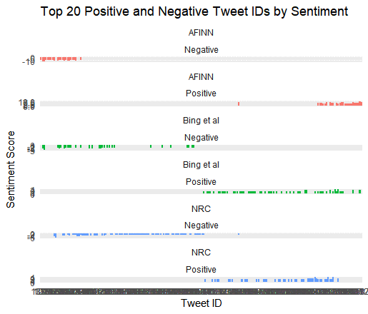

# Observations of Lexica and Opioid Tweets

Upon an initial review of the the top 20 positive and negative tweets by lexica, i.e., AFINN, NRC, and Bing et al., all the lexica display instances of overlap. AFINN seemed to consistently overstate the positivity or negativity of tweets. I believe it has to do with all words being assigned a score regardless of how they interact and interrelate with one other. For instance, tweet #539 which reads, "Tell that bitch I miss it more from a distance. I got codeine in my pores, I can’t kick shit." is the first negative tweet identified by all three lexica. Bing et al., NRC, and AFINN have sentiment scores of, respectively, -3, -3, and -11. My opinion is that the Bing and NRC are the more accurate in this instance. Conversely, the first instance of a positive tweet all three lexica identify is tweet #97, "Being in love is like stabbing your self and then staying hopped up on morphine. High so good but occasionally it just hurts." With scores of 2, 2, and 6 with AFINN again having the highest (positive) value in this instance. While hard to say from the below plot, there appears to be more overlap on the positive end of the spectrum as opposed to the negative. When looking at the most negative tweet according to AFINN, tweet #1020, which says, "Fuck being prescribed dihydrocodeine. I'm sat nursing a migraine worse than the fucking jaw ache I was trying to treat in the first place." While this tweet has an overall negative connotation, I'm of the opinion it isn't the most negative in the entire corpus. Bing assigns it a -4 and NRC does not include it in its top 20. I'm inclined to say Bing is more accurate in the ranking of this tweet, with Bing and NRC being more accurate overall.

{width="973"}
