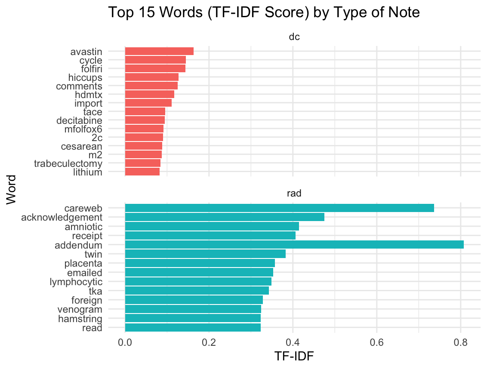
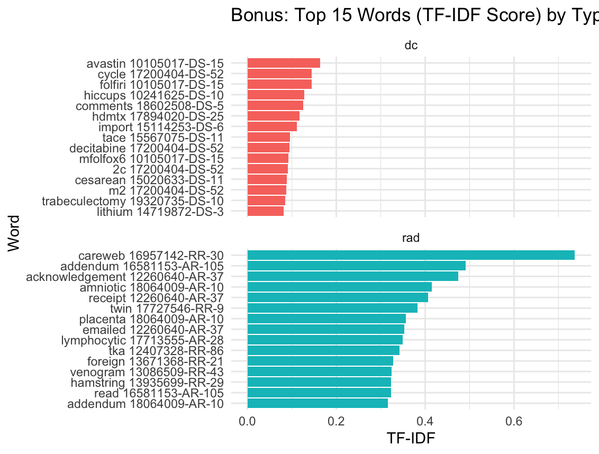

# Overall Observations

My approach was almost identical to the approach used in class and as provided by the code gone over in class. The largest difficult I faced was for Part 2 when I initially messed up the count portion. I was getting negative (-) TF-IDF values (!!!). I also messed up and was group_by(ing) incorrectly. I found it interesting Avastin (Bevacizumab) which is a monoclonal antibody medication used to treat cancer had the highest TF-IDF for discharge notes. I'm not sure what careweb is for radiology notes--I suspect it is a institution specific process or software. The addendum in radiology notes is interesting. Perhaps there was an error initially in the radiology note and it was subsequently corrected?

I'm also not sure what is going on in the plots for Part 2 and the Bonus section. I'm not sure why the radiology TF-IDFs aren't being sorted correctly in the plot whereas they are in the Bonus plot.

# Part 1

## Top 10 TF-IDF Words (Discharge and Radiology) by Note

### *Discharge*

1.  Daily
2.  Your
3.  Sig
4.  bid
5.  refils
6.  plt
7.  disp
8.  glucose
9.  rbc
10. hgb

### *Radiology*

1.  aided
2.  mlo
3.  fibroglandular
4.  gadavist
5.  identifiers
6.  tomsynthesis
7.  dimensional
8.  grouped
9.  localizer
10. mammographic

# Part 2

## Plot of Highest TF-IDF Words by Note Type

# Bonus

## Plot of Highest TF-IDF Words by Note Type (Word Combined w/ Note)

