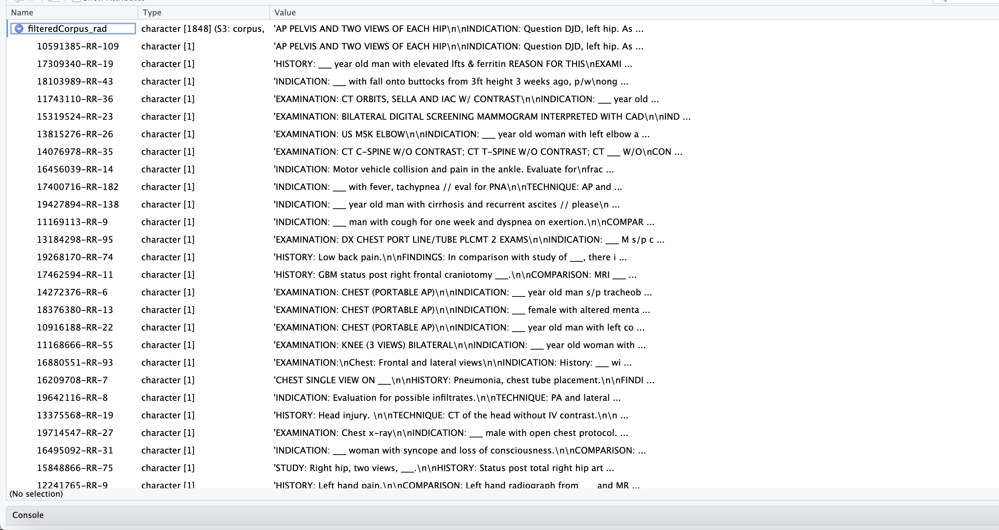
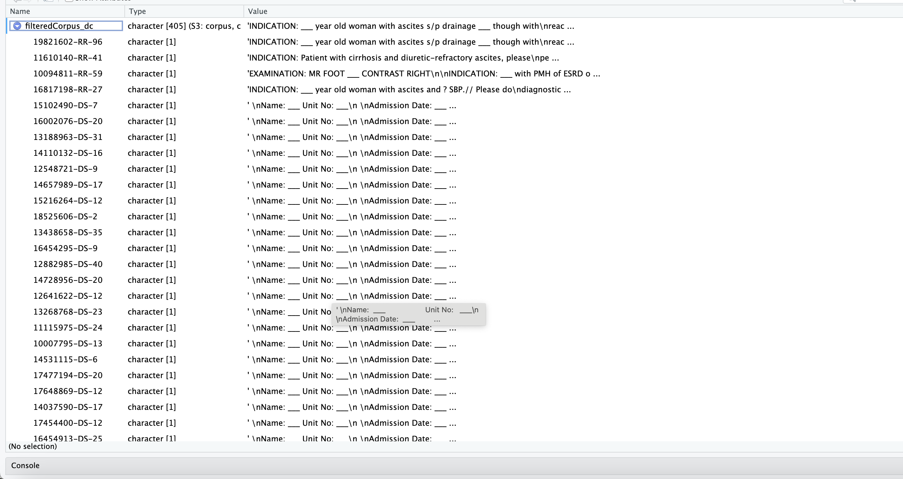

# Part 1

I initially used 10 topics. The results do not seem particularly
coherent other than being able to guess whether a topic primarily deals
with discharge or radiology reports--even then, that is not alwasy
straightforward. I suspect better results after removing stopwords.

ChatGPT4 grouped results into the following topics: Topic 1: Common
Report/Document Terms Topic 2: Medication Prescription Instructions
Topic 3: General Medical/Healthcare Terms Topic 4: Common Language /
General Terms Topic 5: General Language with Potential Medical Context
Topic 6: Pronouns and Associations Topic 7: Common Conjunctions and
Prepositions Topic 8: Pronouns and Actions Topic 9: Common Language /
General Terms with Medical Context Topic 10: Medication Administration
Schedule

# Part 2

Using the same number of topics (10) after removing stopwords.ChatGPT4
identified the following themes:

```         
Topic 1: Medical Imaging / Radiology
Topic 2: Patient Care / Medical History
Topic 3: Prescription / Medication Dosage
Topic 4: Medical Treatment / Patient Management
Topic 5: Medical Imaging / Anatomy
Topic 6: Laboratory Tests / Infection
Topic 7: Patient Symptoms / Clinical History
Topic 8: Physical Examination / Body Orientation
Topic 9: Pharmaceutical / Medication Form
Topic 10: Cardiology / Cardiovascular System
```

5 topics:

```         
Topic 1: General Medical Terms
Topic 2: Pain Management / Medication
Topic 3: Medication and Patient Care
Topic 4: Medical Imaging / Radiology Findings
Topic 5: Medication Dosage and Administration
```

15 Topics:

```         
Topic 1: Respiratory System and Conditions
Topic 2: Oncology and Cancer Treatment
Topic 3: Medication Schedule and Instructions
Topic 4: Patient Care and Medication
Topic 5: Patient Symptoms and Postoperative Care
Topic 6: Laboratory Tests and Results
Topic 7: Imaging Results and Descriptions
Topic 8: Cardiology and Patient History
Topic 9: Bacterial Cultures and Infection
Topic 10: Musculoskeletal System and Radiology
Topic 11: General Observations and Physical Examination
Topic 12: Patient History and Status
Topic 13: Symptoms and Patient Admission
Topic 14: Medication Forms and Dosage
Topic 15: Cardiovascular System and Anatomy
```

Currently, I believe 10 topics is providing the greater amount of
information without being too broad or too specific. I imagine the
"sweet spot" is somewhere between 5-10.

A radiology topic:


A Discharge topic:


# Part 3

# Radiology Documents

# 

# Discharge Documents


